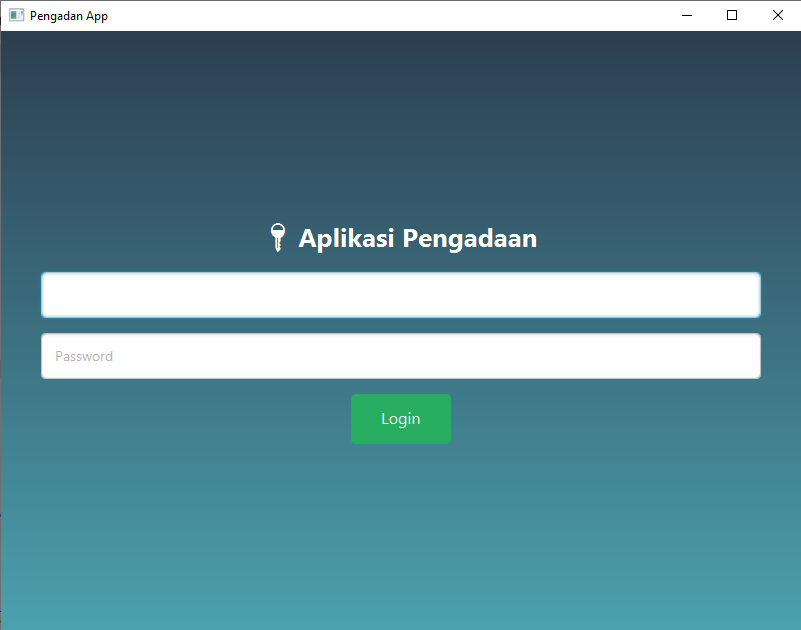
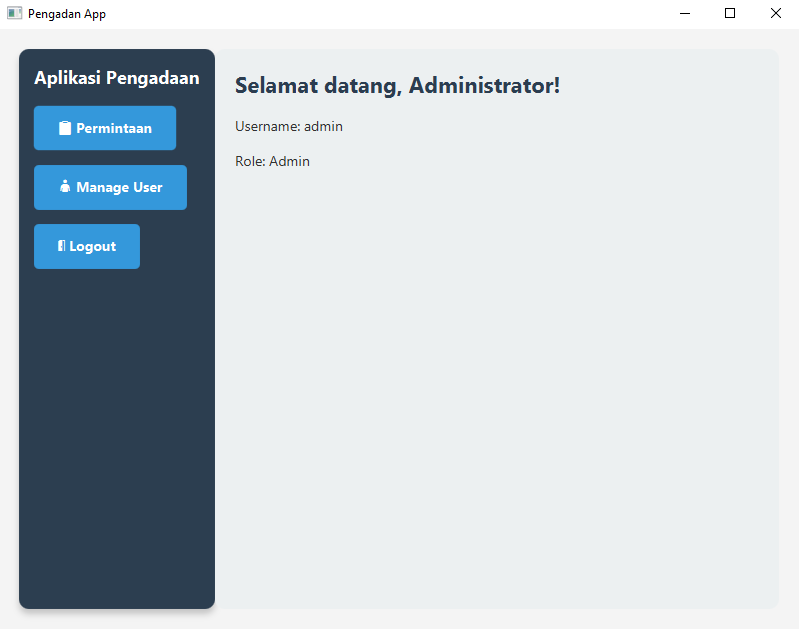
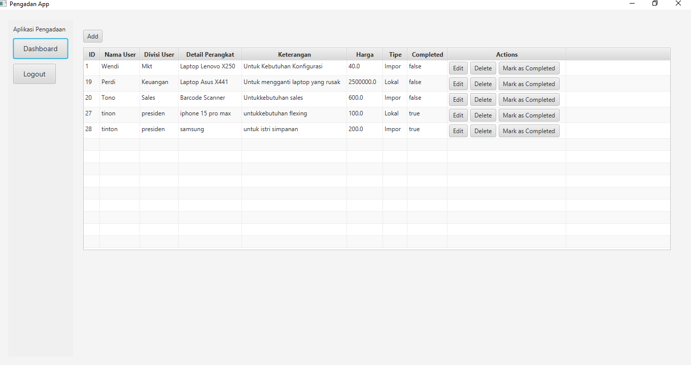
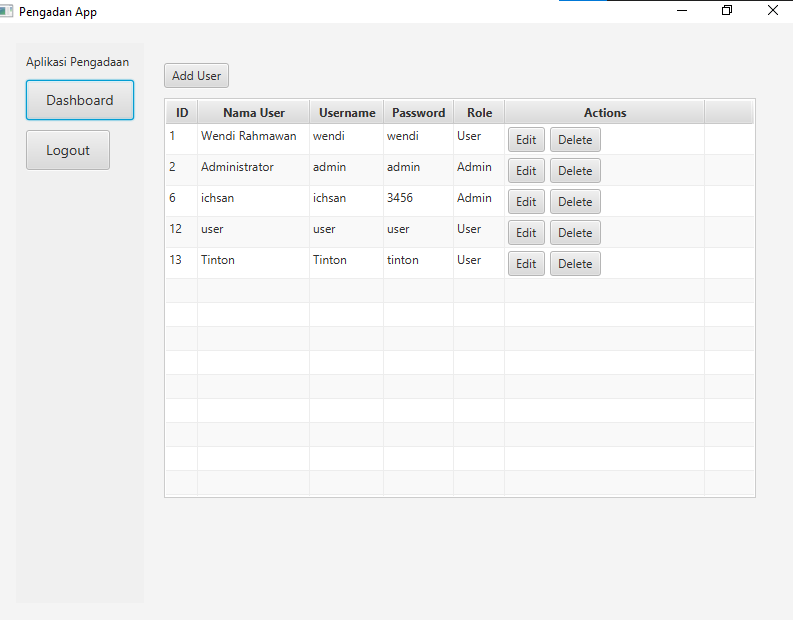
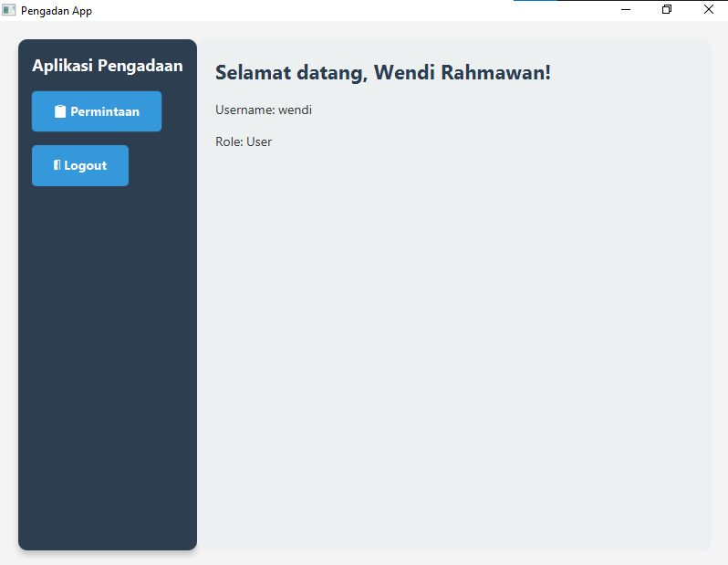
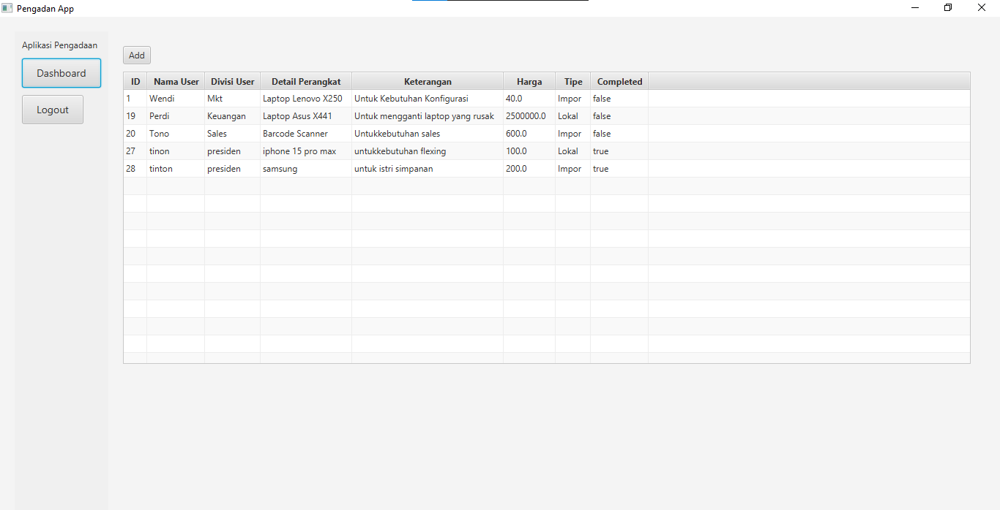
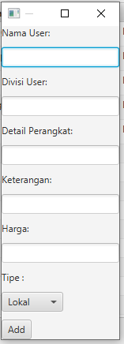
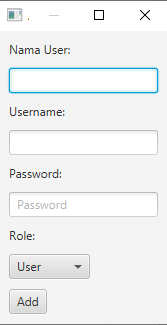

# UAS
UAS-TIF K 23 A
# Final Proyek Pemrograman Berorientasi Obyek 1
<ul>
  <li>Mata Kuliah: Pemrograman Berorientasi Obyek 1</li>
  <li>Dosen Pengampu: <a href="https://github.com/Muhammad-Ikhwan-Fathulloh">Muhammad Ikhwan Fathulloh</a></li>
</ul>

## Kelompok
<ul>
  <li>Kelompok: 9</li>
  <li>Proyek: Aplikasi ITFix & Supply</li>
  <li>Anggota:</li>
  <ul>
    <li>Ketua: <a href="https://github.com/wenrahma">Wendi Rahmawan</a></li>
    <li>Anggota 1: <a href="https://github.com/tinton-despi-alkhifari">Tinton Despi Alkhifari</a></li>
    <li>Anggota 2: <a href="https://github.com/Ichsanpratamap">Ichsan Pratama Putra</a></li>
  </ul>
</ul> 

## Judul Studi Kasus

Aplikasi Manajemen Pengadaan

## Penjelasan Studi Kasus

Aplikasi Manajemen Pengadaan adalah sistem manajemen yang dirancang khusus untuk membantu divisi Pengadaan dalam mengelola permintaan dari pengguna terkait Pengadaan Barang Baru. Aplikasi ini mengumpulkan data data pengajuan pengadaan dari divisi lain. Ada 2 role user pada aplikasi ini yaitu Admin dan User, Admin dapat manage User (CRUD) dan akses penuh dalam manage Permintaan Pengadaan (CRUD), sedangkan User hanya dapat menambah data melihat data Permintaan Pengadaan. Ada 2 kondisi penentuan harga dalam aplikasi ini, dimana jika barang Lokal harga akan tetap sesuai yang diinputkan tetapi jika barang Impor maka harga akan dikali 2 untuk biaya bea cukai dan biaya biaya tambahan lainnya. 

## Penjelasan 4 Pilar OOP dalam Studi Kasus

### 1. Inheritance

Implementasi dari Inheritance terletak pada Permintaan.java sebagai induk, dimana berisi nama user, divisi user, perangkat, keterangan, harga, tipe dan is complete. Turunan pada aplikasi ini adalah PemintaanLokal.java dan PermintaanImport.java. Pada Turunan tidak ada variabel tambahan, keduanya hanya mengambil variabel dari kelas induk. 

### 2. Encapsulation

Kelas Induk jenis permintaan ini menyimpan atribut umum yang dimiliki oleh semua jenis permintaan pengadaan. Variabel-variabel ini diatur sebagai private untuk menjaga data tetap aman, dan hanya dapat diakses melalui metode getter dan setter.

### 3. Polymorphism

Implementasi dari Polimorphism ini ada Pada metode calculateHarga, cara perhitungan harga bisa berbeda antara tipe permintaan. Jika tipe permintaan merupakan Lokal, maka harga sesuai dengan yang diupdate pada field harga sedangkan jika tipe permintaan Import maka harga yang sama dikali 2. 

### 4. Abstract

Implementasi dari Abstract ini terletak pada Permintaan.java dengan ditandai dengan punbli abstract class, yang dimana di dalamnya membuat sebuah metode dengan nama calculateHarga, metode ini digunakan pada kelas turunan PermintaanImport dan PermintaanLokal, menggunakan metode yang sama dari abstract tetapi memiliki hasil berbeda sesuai dengan kondisi yang dibuat di class pemanggil method abstract nya.

## Struktur Tabel Aplikasi
### 1. **Tabel `permintaan`**
| Kolom         | Tipe Data       | Keterangan |
|--------------|---------------|------------|
| `id`        | INT    | Primary Key |
| `nama_user`       | VARCHAR(50)    |  |
| `divisi_user`      | VARCHAR(20)    |  |
| `perangkat` | VARCHAR(50)  |  |
| `keterangan`      | TEXT    |  |
| `harga`   | DOUBLE           |  |
| `tipe`   | VARCHAR(10)           |  |
| `is_complete` | TINYINT(1) |  |

### 2. **Tabel `users`**
| Kolom       | Tipe Data      | Keterangan |
|------------|--------------|------------|
| `id_user`  | INT          | Primary Key (Auto Increment) |
| `namauser` | VARCHAR(50)  |  |
| `username` | VARCHAR(50) |  |
| `password`     | VARCHAR(50) |  |
| `role`      | VARCHAR(20)  |  |

### Login

  

### Tampilan Admin
- Dashboard

  

- Permintaan

  

- User

  

### User
- Dashboard

  

- Permintaan

  

### Modal
- Modal Permintaan

  

- Modal User

  

  
## Demo Proyek
<ul>
  <li>Github: <a href="https://github.com/wenrahma/UAS/">Github</a></li>
  <li>Youtube: <a href="https://youtu.be/GHhHke5865Q">Youtube</a></li>
</ul>
